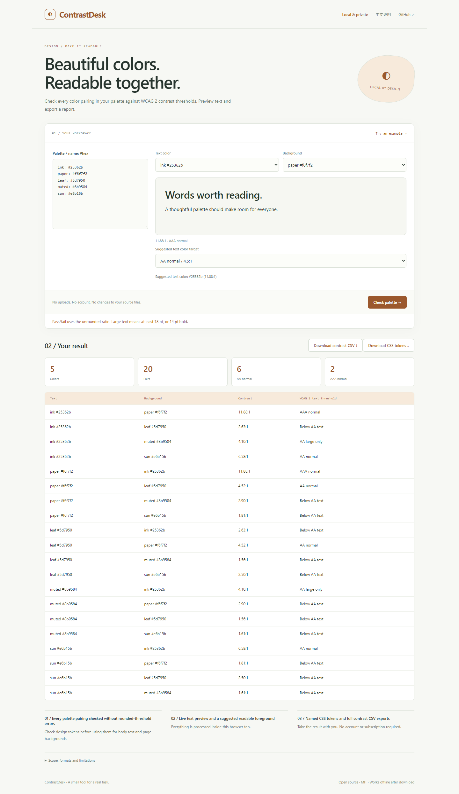

# ContrastDesk

**Beautiful colors. Readable together.**

Check every color pairing in your palette against WCAG 2 contrast thresholds. Preview text and export a report.

[Open the app](https://sq2100.com/contrastdesk/) · [Download offline HTML](https://github.com/sq2100/contrastdesk/releases/latest) · [简体中文](README.zh-CN.md)



## Why use it?

Check design tokens before using them for body text and page backgrounds.

- Every palette pairing checked without rounded-threshold errors
- Live text preview and a suggested readable foreground
- Named CSS tokens and full contrast CSV exports

No uploads, account, API key, tracking scripts, or runtime CDN dependencies. The built app is a single HTML file. Source files are never modified.

## Quick start

Open the [hosted app](https://sq2100.com/contrastdesk/) and click **Try an example**. Or download the HTML from [Releases](https://github.com/sq2100/contrastdesk/releases/latest), then open it in a modern desktop browser.

To build from source (Node.js 20.19+):

```sh
npm ci
npm test
npm run build
```

Open `dist/index.html`, or run `npm start` for a local preview at http://127.0.0.1:4178. Set the `PORT` environment variable to run multiple projects simultaneously.

## Scope and limitations

Uses WCAG 2 relative luminance and contrast for opaque sRGB hex colors; not APCA. Normal-text AA is 4.5:1, AAA is 7:1, and large-text AA is 3:1. Large text is at least 18 pt or 14 pt bold. Values shown are rounded, but pass/fail uses the unrounded ratio. Does not assess gradients, transparency, images, fonts, nontext controls or complete site accessibility. Suggestions mix toward black or white; they are not globally optimal color adjustments. 2–24 colors.

Technical references: [https://www.w3.org/WAI/WCAG21/Understanding/contrast-minimum.html](https://www.w3.org/WAI/WCAG21/Understanding/contrast-minimum.html).

The initial version targets modern desktop browsers. Chromium is used for local smoke checks. Browser differences and real-world data may reveal additional edge cases; please report reproducible problems with synthetic examples. No guarantee of suitability for every input is made.

## Privacy

The app processes data in memory and has no application server, analytics, cookies, local storage or external runtime resources. A Content Security Policy blocks network connections and external scripts. User data is rendered as text, except for the intentionally previewed local images and validated colors.

The hosting provider receives normal page-request metadata (such as IP addresses). Download the HTML and open it offline for disconnected work. Exported files may contain your data. Browser extensions, the operating system and a modified hosted copy are outside this app's control.

## Development

Plain JavaScript, browser APIs, Node’s built-in test runner, and esbuild. Core logic lives in `src/core.js`; UI behavior is in `src/app.js`. Run `npm run format` before sending changes. GitHub Actions tests and builds each push; the separate Pages workflow publishes the demo when run manually.

[Contributing](CONTRIBUTING.md) · [Security](SECURITY.md) · [MIT license](LICENSE)
